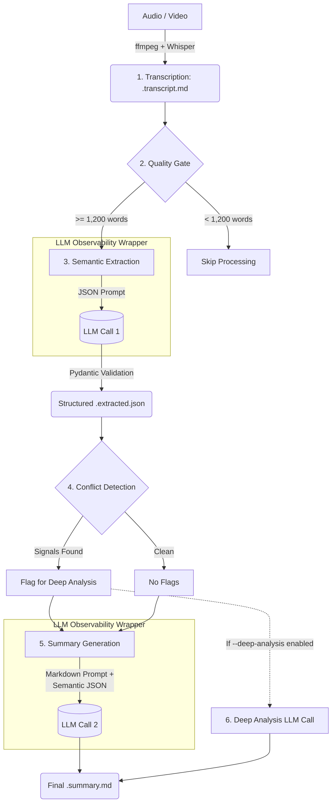

# Meeting Intelligence Pipeline Architecture

This document explains the architecture, design decisions, and libraries used in the Meeting Intelligence Pipeline. The pipeline is designed to turn raw meeting audio/video into structured, actionable intelligence for engineering and product teams.

## 1. How It Works

The pipeline executes as a fixed 6-stage process. 

### The 6 Stages Verbally:
1. **Transcription**: The system uses `ffmpeg` to extract audio from video files, then runs it through the local `Whisper` model to generate a raw text transcript (`.transcript.md`).
2. **Quality Gate**: A heuristic check ensures the transcript is actually a meeting. It strips out filler words (um, ah, like) and checks if there are at least 1,200 meaningful words (roughly a 15-minute meeting). If not, it skips expensive LLM processing.
3. **Semantic Extraction**: The first LLM call. It reads the transcript and extracts entities, requirements, decisions, risks, features, and constraints into a strict, machine-readable JSON format (`.extracted.json`). This runs through Pydantic to ensure schema compliance.
4. **Conflict Detection**: A heuristic scan of the extracted JSON. It looks for high-severity risks or terms like "breaking", "conflict", or "replace" in the constraints and open questions.
5. **Summary Generation**: The second LLM call. It takes the original transcript **plus** the structured JSON from step 3 to generate a rich, human-readable executive summary (`.summary.md`).
6. **Deep Analysis (Optional)**: If Step 4 found conflicts and the user passed `--deep-analysis`, a third LLM call specifically analyzes the conflicts and appends mitigation strategies to the final summary.

All LLM calls (Stages 3, 5, 6) are routed through an **Observability Wrapper** that automatically logs token usage, latency, prompt versions, and model info to a daily JSONL file.

---

## 2. Why It's Built This Way

### **Intermediary Structured JSON (Semantic Payload)**
Instead of going straight from Transcript → Markdown Summary, we force the LLM to output a structured JSON object first. 
* **Why?** Markdown is great for humans, but terrible for downstream automation. By having a `.extracted.json` file, you can easily plug this pipeline into an automated Jira ticket creator, a dashboard, or a Notion database without having to parse unstructured text. Furthermore, feeding this structured data *into* the final summarization prompt grounds the LLM, reducing hallucinations.

### **Heuristics Before AI (The Pipeline Guards)**
Transcribing audio is computationally expensive, and calling LLMs costs money. 
* **Why?** The Quality Gate prevents burning API credits on 30-second audio clips or pocket-dials. The Conflict Detector uses fast Regex/heuristics on the JSON payload to decide if we *need* a deep-analysis LLM call, rather than doing deep analysis blindly on every meeting.

### **The Observability Context Manager**
Instead of scattering logging code everywhere, we use a Python context manager (`with llm_call_context(...) as ctx:`).
* **Why?** It centralizes the timing `time.perf_counter()` and token extraction logic. If an API call fails, the context manager catches it, logs the failure, and re-raises the error. By automatically hashing the prompt and versioning it, we can look at the daily log and say: *"Ah, latency spiked when we moved to summary_v2."*

### **The Strategy & Factory Patterns for LLMs**
The code defines a strict `LLMProvider` interface (Protocol) and an `LLMFactory`.
* **Why?** The LLM space moves fast. Right now it's OpenAI and Gemini, but tomorrow it might be Anthropic or DeepSeek. By decoupling the main pipeline from the specific API clients, adding a new provider requires creating one single class that implements `generate()`, with zero changes to the rest of the app.

### **File-Based Prompt Versioning**
Prompts live in `prompts/summary/v1.txt` instead of being hardcoded strings in Python.
* **Why?** Prompts are data, not code. You shouldn't need to read through Python logic to tweak an LLM instruction. The file-based system automatically picks the highest version number, allowing product managers to iterate on prompts without touching the codebase.

---

## 3. Libraries Used

| Library | Purpose | Why this specific library? |
| :--- | :--- | :--- |
| **`pydantic`** | Data validation | The gold standard for Python data validation. It guarantees that the JSON returning from the Semantic Extraction LLM perfectly matches our expected data types before we save it or act on it. |
| **`openai-whisper`** | Speech-to-text | It runs locally. This avoids uploading sensitive private meeting audio to a third-party API, and has zero marginal cost per minute of audio. |
| **`openai` & `google-generativeai`** | LLM SDKs | Official maintained clients that handle retries, timeouts, and token usage metadata securely. |
| **`python-dotenv`** | Config management | Standard lightweight way to load API keys without hardcoding them, prioritizing security. |
| **`pytest`** | Testing framework | Simple, powerful, and allows for extensive use of `unittest.mock` to simulate LLM calls without spending actual API credits during CI/CD. |
| **Standard Library** | `subprocess`, `dataclasses`, `json`, `argparse` | Used heavily to minimize dependency bloat. `subprocess` handles ffmpeg, while `dataclasses` provide lightweight schema definition for internal objects (like `LLMResult`). |

> [!TIP]
> **Extensibility**
> Because of the modular architecture, adding a new feature (like Auto-Jira integration) is as simple as adding a new stage after Stage 4 that reads the `extracted.json` file. The core system does not need to change.
