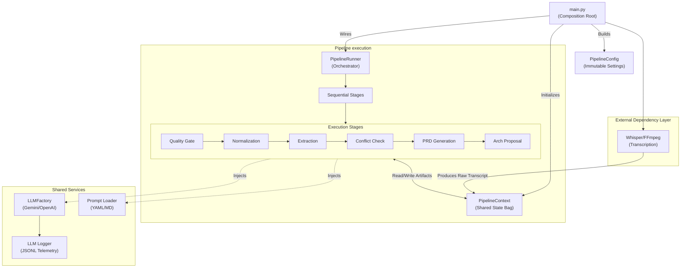

# Meeting Intelligence Pipeline — Progress Report

## Overview

The Meeting Intelligence Pipeline is designed to taking meeting recordings (audio/video/markdown) and converting them into actionable software engineering assets, including normalized transcripts, structured semantic payloads, Product Requirements Documents (PRDs), and Architecture specifications.

## Program Structure

The application adopts an object-oriented, modular architecture using Pure Dependency Injection. The codebase is mainly organized into a composition root (`main.py`) and a core backend package (`helper/`).

## File Structure

```text
meeting-intelligence-pipeline/
├── main.py                 # Composition Root & Entrypoint
├── pyproject.toml          # uv project metadata
├── helper/
│   ├── pipeline/           # Orchestration logic
│   │   ├── runner.py       # Sequential execution loop
│   │   ├── stages.py       # Domain-specific AI stages
│   │   ├── config.py       # Immutable settings & context
│   ├── llm/                # LLM Infrastructure (Strategy Pattern)
│   │   ├── factory.py      # Provider selection
│   │   ├── base.py         # Provider interfaces
│   │   ├── gemini_provider.py
│   │   └── openai_provider.py
│   ├── llm_logger.py       # Observability/Telemetry
│   ├── prompt_loader.py    # Multi-version prompt management
│   ├── pipeline_guards.py  # Quality & word-count checks
│   └── semantic_extractor.py
└── prompts/                # Raw Prompt Store (Versioned)
    ├── normalization/
    ├── extraction/
    ├── architecture/
    └── interpretation/
```

### Core Components

1. **Composition Root (`main.py`)**:
   - Acts as the entrypoint (similar to .NET's `Program.cs`).
   - Parses CLI arguments (`--input`, `--whisper-model`, `--llm-model`, `--min-words`, etc.).
   - Orchestrates the "Pre-Stage" (audio extraction via FFmpeg and transcription via Whisper).
   - Wires up dependencies (LLM factories and prompt loaders without a DI container) and constructs the `PipelineRunner`.

2. **Pipeline State Management (`helper/pipeline/config.py`)**:
   - `PipelineConfig`: An immutable configuration object containing settings like the chosen LLM model, logging directory, minimum word count cutoff, etc.
   - `PipelineContext`: A mutable state bag that flows through the execution pipeline, holding intermediate outputs. It is akin to `HttpContext` in ASP.NET.
   - `PipelineResult`: An immutable result snapshot returned after execution completes, separating the domain output from side effects.

3. **Pipeline Runner (`helper/pipeline/runner.py`)**:
   - Iterates through a fixed sequence of `PipelineStage` objects.
   - Passes the shared `PipelineContext` sequentially. Checks for early termination flags (e.g., `skipped` flags if transcripts are too short).

### Extensibility & Patterns

- **Dependency Injection**: Dependencies like `LLMFactory` and `load_prompt` are injected dynamically into stages.
- **Pipeline/Middleware Pattern**: Operations are strictly sequenced as modular stages.
- - - **Observability**: Execution states and API boundaries are heavily logged.

+ - **Observability (Telemetry-First)**: Every LLM call is recorded in daily JSONL logs. The system prioritizes cost and performance tracking (token counts, latency, and prompt versioning) over full payload persistence. While this supports performance tuning and version comparisons, it does not currently store raw strings for full request/response replay.

## Workflow Execution

The standard execution flow progresses through multiple distinct stages.

The initial step is **Pre-Stage (Transcription)**:
If an audio or video file is provided, it extracts audio using FFmpeg and transcribes the file relying on Whisper (`whisper_model`). It outputs a raw `Transcript.md`.

Once the raw transcript is generated, the pipeline executes the following stages sequentially:

1. **QualityGateStage**: Evaluates if the raw transcript is workable, such as validating word count to ensure the meeting material is sufficient to process. If unmet, the pipeline short circuits (`ctx.skipped = True`).
2. **NormalizationStage**: Takes the raw whispered output, formats it, corrects speaker attributions, and generally tidies the grammar/noise to produce a clean transcript.
3. **ExtractionStage**: Processes the normalized text to parse critical domains semantics out of the conversation. Output is bound to the context as a structural semantic JSON object.
4. **ConflictCheckStage**: Runs domain validation checks to identify conflicting requirements or unviable system constraints requested in the meeting.
5. **InterpretationStage**: Utilizes the LLM to output a structured **Product Requirements Document (PRD)** based on semantics and normalized context.
6. **ArchitectureStage**: Translates the logical PRD concepts into an architecture proposal (skipped if `--skip-architecture` is passed).

## Current Status and Insights

- **Robustness:** The application is heavily reliant on a structural interface pattern, keeping coupling low between AI stages and specific LLM dependencies.
- **Developer Experience:** The project utilizes modern Python build systems (`uv`) and effectively maintains cross-platform functionality (e.g. including macOS SSL certificate workarounds).
- **Graceful Failures:** Exception boundaries are clear, tracking states properly without leaving unhandled zombie outputs.


In conclusion, the system translates a highly subjective domain (conversational meeting transcriptions) into an immutable, structured transformation pipeline effectively translating .NET style architectural strengths into a Python application.

## Module Relationship Chart



### Key Module Interactions
1.  **Composition Root (`main.py`)**: Responsible for "Pure DI." It instantiates the shared services and injects them into the stages.
2.  **Shared State (`PipelineContext`)**: Instead of stages passing data directly to each other, they all read/write to this central "State Bag." This makes adding or reordering stages trivial.
3.  **Dependency Isolation**: The logic stages don't know *which* LLM provider is being used; they just call the injected `LLMFactory`.
4.  **Telemetry Loop**: The `LLM Logger` wraps the provider calls, ensuring that every interaction is timed and logged without the logic stages needing to handle logging themselves.
